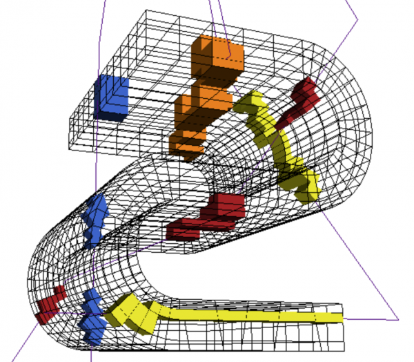
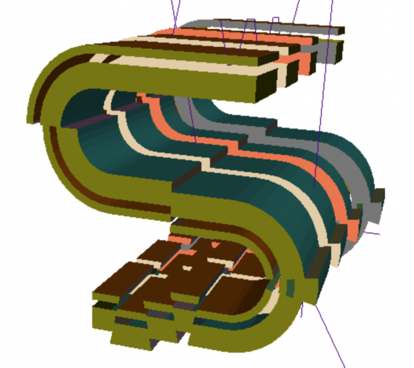

Creating a Test Dataset
=======================

This short tutorial makes use of a resqpy test function to generate a small dataset which can be used in other tutorials. Creating a RESQML dataset from scratch is significantly more complicated than reading an existing dataset and will be covered in later tutorials.

Importing from a test module
----------------------------
Test modules can be acquired by cloning/downloading from the repository.

For the following import to work, the resqpy code will need to have high priority in the environmental PATH. This can be achieved with something like:

.. code-block:: python

    import sys
    sys.path.insert(0, '/path/to/your/resqml')

The test modules included in the resqpy repository are primarily for automated testing to help ensure that code changes don't break existing functionality. However, some of the modules can also be used to generate small test datasets for use in these tutorials, for example:

.. code-block:: python

    from tests.test_s_bend import test_s_bend_fn

If that import fails, you might need to track down the test_s_bend.py module and copy it into your working directory, and then try:

.. code-block:: python

    from test_s_bend import test_s_bend_fn

Alternatively, try modifying the PYTHONPATH environment variable prior to running your Python script so that one of those two formulations works.

Creating the S-bend dataset
---------------------------
Having imported the function, the S-bend dataset can be generated with:

.. code-block:: python

    test_s_bend('s_bend.epc')

You can substitute whatever path or filename you like, but you should use the extension ``.epc`` This file will be created, along with a paired hdf5 format file with the same name, but extension ``.h5``

(The function generates a few warning messages, which might appear, depending on what Python log handling is active in your environment. These warnings can be ignored.)

About the S-bend model
----------------------
The S-bend model contains some Ijk Grid objects, Wellbore Trajectory Representations and Blocked Wellbore Representations, plus a few other objects. The model contains some quite extreme geometries, as its main purpose is for testing that other code can handle some of the more challenging features that can be represented in RESQML.

In particular, the 3 grids have variants of a geometry which include two recumbent folds (with an inverted section of reservoir between). They all contain a totally pinched out layer. Two of the grids include several faults in the geometry, including some with a lateral slip between split pillars. One of those two grids also contains a K Gap.

Three of the four wells also have rather unrealistic trajectories, designed to test well to grid intersection code.

Checking the contents of the S-bend dataset
-------------------------------------------
To check that the S-bend model has been generated, you can open it as shown in the previous tutorial:

.. code-block:: python

    import resqpy.model as rq
    s_bend = rq.Model('s_bend.epc')

You can then check the list of parts with:

.. code-block:: python

    s_bend.parts()

which should produce something like:

.. code-block:: python

    ['obj_LocalDepth3dCrs_61e89d62-614e-11eb-940b-248a07af10b2.xml',
    'obj_IjkGridRepresentation_61e8997a-614e-11eb-940b-248a07af10b2.xml',
    'obj_MdDatum_61f00782-614e-11eb-940b-248a07af10b2.xml',
    'obj_WellboreTrajectoryRepresentation_61f03f2c-614e-11eb-940b-248a07af10b2.xml',
    'obj_WellboreTrajectoryRepresentation_61f343c0-614e-11eb-940b-248a07af10b2.xml',
    'obj_WellboreTrajectoryRepresentation_61f5ca28-614e-11eb-940b-248a07af10b2.xml',
    'obj_WellboreTrajectoryRepresentation_61f87444-614e-11eb-940b-248a07af10b2.xml',
    'obj_BlockedWellboreRepresentation_621a10a4-614e-11eb-940b-248a07af10b2.xml',
    'obj_BlockedWellboreRepresentation_622a66fc-614e-11eb-940b-248a07af10b2.xml',
    'obj_BlockedWellboreRepresentation_62361128-614e-11eb-940b-248a07af10b2.xml',
    'obj_BlockedWellboreRepresentation_6245fbf6-614e-11eb-940b-248a07af10b2.xml',
    'obj_IjkGridRepresentation_6274e52e-614e-11eb-940b-248a07af10b2.xml',
    'obj_PropertyKind_6276f40e-614e-11eb-940b-248a07af10b2.xml',
    'obj_DiscreteProperty_627572be-614e-11eb-940b-248a07af10b2.xml',
    'obj_BlockedWellboreRepresentation_628708bc-614e-11eb-940b-248a07af10b2.xml',
    'obj_BlockedWellboreRepresentation_62906132-614e-11eb-940b-248a07af10b2.xml',
    'obj_BlockedWellboreRepresentation_629a94e0-614e-11eb-940b-248a07af10b2.xml',
    'obj_BlockedWellboreRepresentation_62a95dcc-614e-11eb-940b-248a07af10b2.xml',
    'obj_IjkGridRepresentation_62d7a2cc-614e-11eb-940b-248a07af10b2.xml',
    'obj_BlockedWellboreRepresentation_62f7f6d0-614e-11eb-940b-248a07af10b2.xml',
    'obj_BlockedWellboreRepresentation_630e9a02-614e-11eb-940b-248a07af10b2.xml',
    'obj_BlockedWellboreRepresentation_63234d30-614e-11eb-940b-248a07af10b2.xml',
    'obj_BlockedWellboreRepresentation_6343a2a6-614e-11eb-940b-248a07af10b2.xml']

(The hexadecimal uuids will differ from those shown here, and it's possible that the order of the list will be different.)
