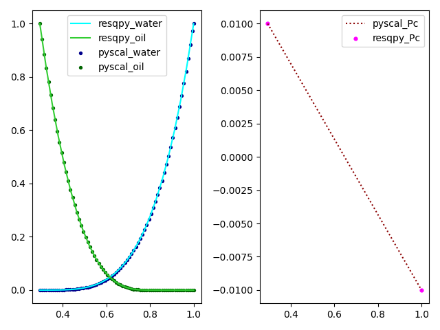

Working with the RelPerm class and equinor/pyscal
=================================================

This tutorial describes two workflows that allow us to pass relative permeability and capillary pressure data between the resqpy library and the `equinor\\pyscal <https://github.com/equinor/pyscal>`_ library.

We will be moving water-oil relperm data between resqpy's :class:`resqpy.olio.relperm.RelPerm` class and pyscal's :class:`pyscal.WaterOil` class.

Please note that similar workflows can be used for moving gas-oil data to/from the :class:`pyscal.GasOil` class.

Importing the relperm and wateroil modules
------------------------------------------

In this tutorial we will be moving water-oil relperm data between the ``RelPerm`` object's :meth:`resqpy.olio.relperm.RelPerm.dataframe` method and the ``WaterOil`` object's :attr:`pyscal.WaterOil.table` attribute.

.. code-block:: python

    from resqpy.olio.relperm import RelPerm
    from pyscal import WaterOil
    # import a plotting library for visual inspection of the data
    import matplotlib.pyplot as plt
    # import resqpy model module to interact with a resqpy model
    import resqpy.model as rm

resqpy RelPerm.dataframe() to pyscal WaterOil.table
---------------------------------------------------

Initialize an instance of a ``RelPerm`` object that is stored in a resqpy ``Model`` instance. This can be done using the *uuid* of the existing ``Grid2dRepresentation`` object that acts as support for the dataframe of relperm data.

.. code-block:: python

    model = rm.Model('/path/to/my_file.epc')
    relperm_wo = RelPerm(model = model, uuid = uuid)

The dataframe of water-oil relperm data is then accessed using the :meth:`resqpy.olio.relperm.RelPerm.dataframe` method.

.. code-block:: python

    relperm_wo_df = relperm_wo_obj.dataframe()

To initialize a pyscal ``WaterOil`` object, we first need to define a water saturation end-point that is compatible with the ``RelPerm`` dataframe being inputted. In this case, we can define *swl*, which will be the first water saturation in the generated ``WaterOil`` table, and set it equal to the minimum water saturation value in the ``RelPerm`` dataframe.

.. code-block:: python

    swl = relperm_wo_df.min()['Sw']
    pyscal_wo = WaterOil(swl = swl)

The pyscal :meth:`pyscal.WaterOil.add_fromtable` method generates a relperm table by interpolating relative permeability and capillary pressure data from the inputted dataframe.

.. code-block:: python

    pyscal_wo.add_fromtable(dframe = relperm_wo_df, swcolname = 'Sw', krwcolname='Krw', krowcolname='Kro', pccolname='Pc')
    pyscal_wo_df = pyscal_wo.table

We'll generate some plots to visually compare the inputted ``RelPerm`` data to the ``WaterOil`` data.

.. code-block:: python

    fig, (ax1, ax2) = plt.subplots(nrows = 1, ncols = 2)
    ax1.plot(relperm_wo_df['Sw'], relperm_wo_df['Krw'], label = 'resqpy_water', c = 'cyan')
    ax1.plot(relperm_wo_df['Sw'], relperm_wo_df['Kro'], label = 'resqpy_oil', c = 'limegreen')
    ax1.scatter(pyscal_wo_df['SW'], pyscal_wo_df['KRW'], label = 'pyscal_water', c = 'darkblue', s = 8)
    ax1.scatter(pyscal_wo_df['SW'], pyscal_df['KROW'], label = 'pyscal_oil', c = 'darkgreen', s = 8)
    ax1.legend( )
    ax2.scatter(relperm_wo_df['Sw'], relperm_wo_df['Pc'], label = 'resqpy_Pc', c = 'magenta', s = 12)
    ax2.plot(pyscal_wo_df['SW'], pyscal_wo_df['PC'], label = 'pyscal_Pc', linestyle = 'dotted', c = 'darkred' )
    ax2.legend( )
    fig.tight_layout()
    plt.show()

The image below compares two sets of relperm and capillary pressure data:

pyscal WaterOil.table to resqpy RelPerm.dataframe()
---------------------------------------------------

Moving data in the opposite direction is simple, and involves reformatting the column names of the ``WaterOil`` table to be compatible with the ``RelPerm`` initialiser method.
We reference the same ``WaterOil`` table instance, pyscal_wo_df, from the previous section.

.. code-block:: python

    model = rm.Model('/path/to/my_file.epc')
    all_relevant_pyscal_cols = ['SW', 'SG', 'KRW', 'KRG', 'KROW', 'KROG']
    cols = sorted(list(set(pyscal_wo_df.columns).intersection(set(all_relevant_pyscal_cols))), reverse=True)
    if 'PC' in pyscal_wo_df.columns:
        cols.append('PC')
    col_remap_dict = {k: (k.capitalize() if len(k) < 4 else k.capitalize()[0:3]) for k in cols}
    pyscal_wo_df_processed = pyscal_wo_df[cols].rename(columns = col_remap_dict)
    # intialize a new RelPerm object, write hdf5 and create xml for object
    relperm_wo = RelPerm(model = model, df = pyscal_wo_df_processed)
    relperm_wo.write_hdf5_and_create_xml()